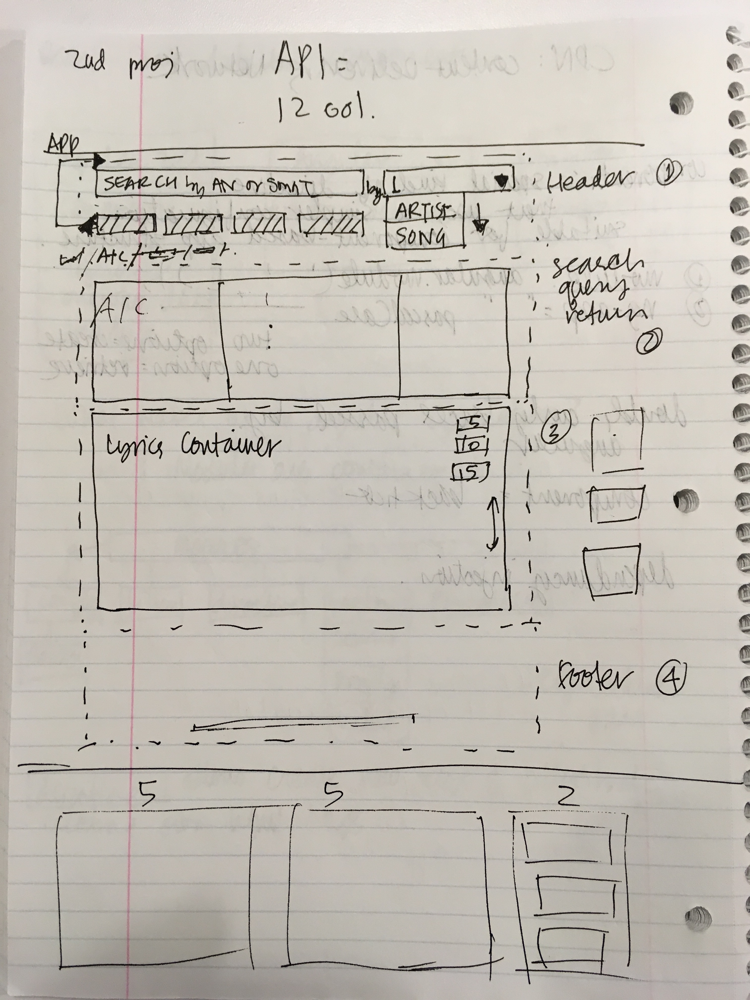

# Welcome to Lyricist!

Lyricist is a React-based web application for querying and displaying song lyrics while simultaneously allowing the user to view and, if they choose, play top Youtube results for the queried song.  

## User Stories

After creation, your project should look like this:

## Product Description

Technologies used to create this application include:
* React.js
* MongoDB
* Mongoose
* Bootstrap
* axios
* CORS

## Wireframes

Inline-style:

