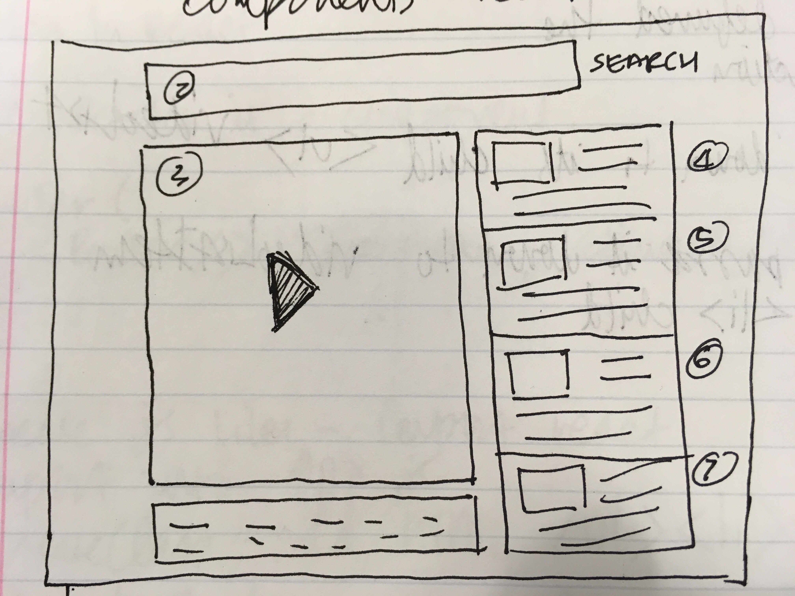

# Welcome to Lyricist!

Lyricist is a React-based web application for querying and displaying song lyrics while simultaneously allowing the user to view and, if they choose, play top Youtube results for the queried song.  

## User Stories

This application was developed with musicians in mind.  A member of the development group came up with the concept for this application based on his own utilization of lyrics sites and related problems with them.  The site is intended for a musician to able to easily view lyrics while simultaneously listening to the song via youtube.

User should be able to:
1. Search for a song of their choice;
2. Receive lyrics and top youtube hits for the song;
3. Be able to easily scroll through lyrics while page remains static;
4. Simultaneously be able to scroll through lyrics and watch youtube video; and
5. Select alternate videos if warranted.

## Product Description

Components of the application include:
* Front-end developed using React.js
* Back-end & lyrics API developed using Express and MongoDB
* Use of our own lyrics API and youtube API

Technologies used to create this application include:
* React.js
* MongoDB
* Mongoose
* Bootstrap
* axios
* CORS

## "Wireframes" (term used loosely)

"Wireframe" 1:

"Wireframe" 2:

